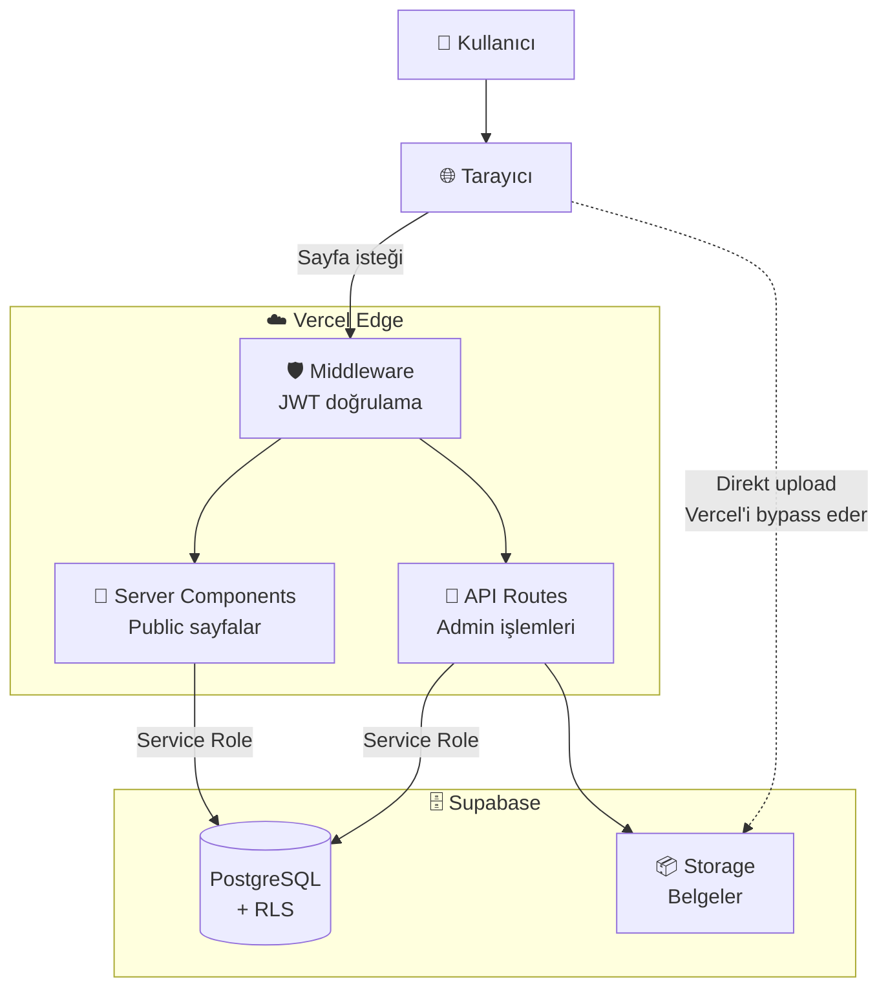
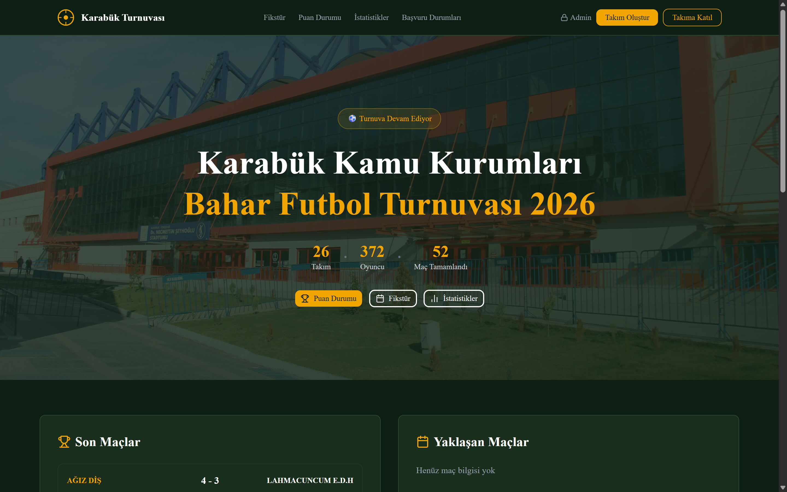
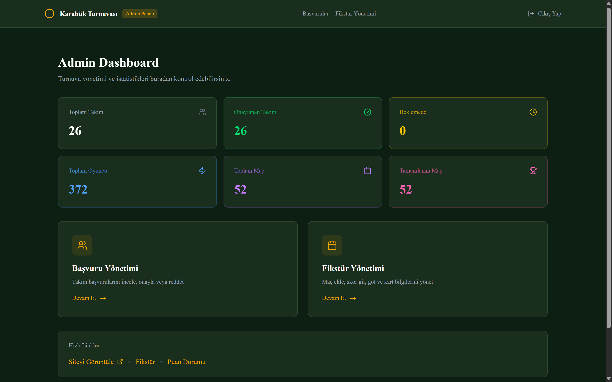
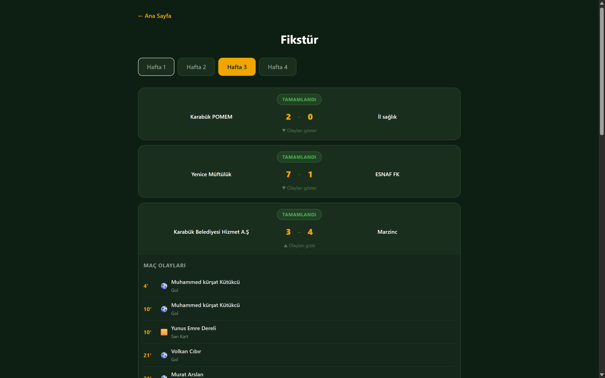
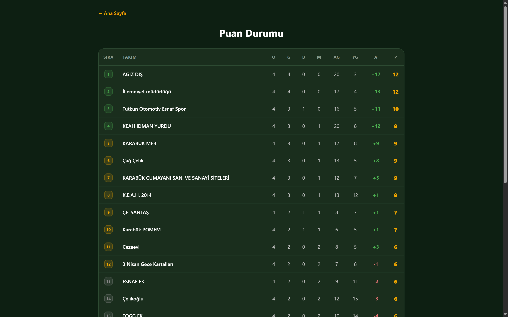
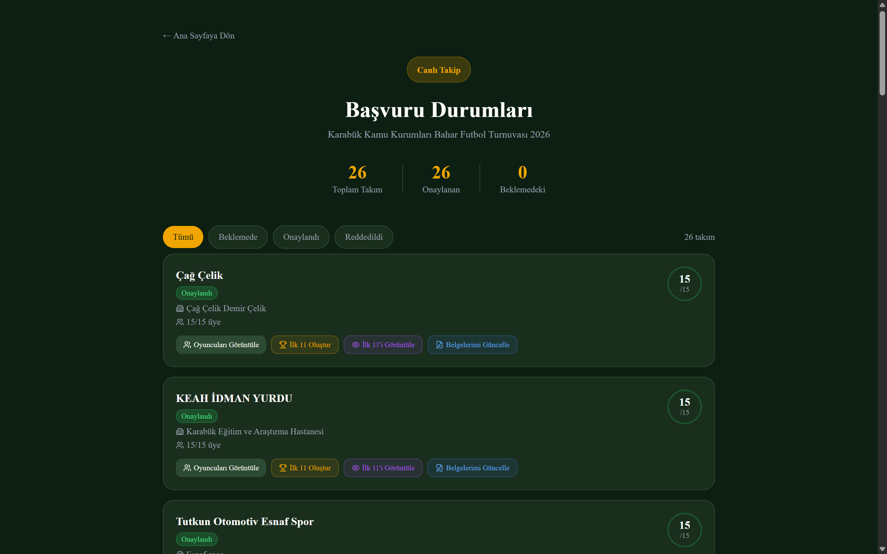

# Karabük Kamu Kurumları Bahar Futbol Turnuvası

> **A production-grade tournament management platform serving 385+ active users and 26 teams in Karabük, Türkiye. Built solo with Next.js 14, Supabase, and Vercel — handling team registration, fixture management, live scoring, and document workflows.**

<p align="center">
  <a href="https://turnuvaburada.com.tr">
    
  </a>
</p>

<p align="center">
  
  
  
  
  
  
  
</p>

---

## 📖 Proje Hakkında

**Karabük Kamu Kurumları Bahar Futbol Turnuvası**, Karabük'te düzenlenen kurumsal bir futbol turnuvası için sıfırdan tasarlanıp geliştirilen, **canlı kullanımda olan** bir turnuva yönetim sistemidir.

Bu proje, ücreti karşılığında üstlendiğim ve tek başıma **fikir aşamasından canlı yayına** kadar geliştirdiğim full-stack bir uygulamadır. Şu anda **385+ aktif kullanıcı** (oyuncu, takım kaptanı, admin) sistemi günlük olarak kullanmaktadır.

### 🎯 Çözdüğü Problem

Geleneksel olarak Excel tabloları ve WhatsApp grupları üzerinden yürütülen turnuva organizasyonunu, modern bir web platformuna taşıdı. Kayıt, belge yönetimi, fikstür, puan durumu ve maç olayları tek bir merkezi sistemde yönetiliyor.

### 📊 Anlık Sayılar

- **26 takım** aktif olarak kayıtlı
- **385+ kullanıcı** sisteme dahil
- **2 admin** sistemi yönetiyor
- **Champions League formatında** lig + playoff yapısı

---

## 🚀 Öne Çıkan Özellikler

### 👥 Çok Rollü Kullanıcı Sistemi
- **Admin paneli:** Birden fazla yetkili (Supabase `admins` tablosu üzerinden, env var değil)
- **Kaptan paneli:** Takım yöneticileri kendi takım kadrolarını ve belgelerini yönetebilir
- **Oyuncu başvuru sistemi:** TC kimlik no, doğum tarihi, fotoğraf ve belge yükleme

### ⚽ Turnuva Yönetimi
- Takım kayıt ve oyuncu başvuru akışı
- Belge yükleme ve güncelleme (TC fotoğrafı, ehliyet, sözleşme)
- Fikstür yönetimi (maç oluşturma, sonuç girme, hafta bazlı planlama)
- Maç olayları (gol, sarı kart, kırmızı kart, dakika bazlı)
- **İlk 11 (lineup)** belirleme sistemi

### 📊 Public Sayfalar
- **Fikstür sayfası** (`/fikstir`) — Oynanmış ve oynanacak maçlar
- **Puan durumu** (`/puan-durumu`) — Champions League stilinde (W=3, D=1, L=0, ilk 4 doğrudan, 5–12 playoff)
- **İstatistikler** (`/istatistikler`) — Gol kralı, asist kralı, kart sıralaması
- **Takım sayfaları** — Her takımın kadrosu, oyuncuları, belgeleri

### 🔐 Güvenlik
- bcrypt ile hash'lenmiş şifreler
- Jose JWT ile 8 saatlik admin oturumları
- Middleware tabanlı route koruması (defense in depth)
- Supabase RLS (Row Level Security) ile veritabanı seviyesinde koruma

---

## 🛠 Teknoloji Stack'i

| Katman | Teknoloji | Neden? |
|---|---|---|
| **Framework** | Next.js 14 (App Router) | Server components, API routes, edge middleware |
| **Dil** | TypeScript | Tip güvenliği, daha az runtime hata |
| **Veritabanı** | Supabase (PostgreSQL) | Hazır auth, RLS, real-time, storage |
| **Storage** | Supabase Storage | 50MB limit, signed URL desteği |
| **Stil** | Tailwind CSS + shadcn/ui | Hızlı development, tutarlı tasarım |
| **Auth** | jose (JWT) + bcryptjs | Edge-compatible JWT, güvenli hash |
| **Hosting** | Vercel | Otomatik CI/CD, edge functions, preview deployments |

---

## 🏗 Mimari Diyagramı



---

## 💡 Mimari Kararlar

Bu projede aldığım dört kritik kararı ve gerekçelerini aşağıda detaylandırıyorum. Bunlar, "neden böyle yaptın?" sorularına verdiğim cevaplardır.

### 1. Direkt Supabase Storage Upload (Vercel Bypass)

**Problem:** Vercel'in Hobby planında API rotalarına gönderilebilen body boyutu **4.5 MB** ile sınırlı. Oyuncu başvurularında TC fotoğrafı, ehliyet gibi belgeler bu limiti aşabiliyor.

**Çözüm:** Dosya yükleme akışını yeniden tasarladım. Tarayıcı, dosyayı **doğrudan** Supabase Storage'a yüklüyor (`lib/uploadFile.ts`). Sadece dosya metadata'sı (path, owner_id, owner_type) Vercel API rotası üzerinden DB'ye yazılıyor.

```
ÖNCESİ:  Browser → Vercel API (4.5MB limit) → Supabase Storage
SONRASI: Browser → Supabase Storage (50MB limit)
                ↓
         Browser → Vercel API → DB (sadece metadata)
```

**Kazanç:** 50MB'a kadar dosya yükleme + Vercel bandwidth tasarrufu + daha hızlı upload.

### 2. Multi-Admin Sistemi (Env Var Yerine DB Tablosu)

**Problem:** İlk versiyonda admin email'i bir environment variable olarak tanımlıydı. Yeni admin eklemek için kod deploy etmek gerekiyordu.

**Çözüm:** `admins` tablosu oluşturdum. Her admin'in `email`, `password_hash` (bcrypt), `name` alanları var. Login akışı önce DB'den email'i bulur, sonra `bcrypt.compare` ile şifreyi doğrular, başarılıysa JWT üretir.

**Kazanç:** Yeni admin eklemek artık SQL bir satır. Şifre değişimi runtime'da. Kod değişikliği veya deploy gerektirmiyor.

### 3. RLS ile Güvenli Public/Private Veri Ayrımı

**Problem:** Aynı tablolarda hem public okumaya açık olması gereken veriler (örneğin takım listesi) hem de gizli kalması gereken veriler (örneğin admin şifre hash'leri, oyuncu kişisel belgeleri) var.

**Çözüm:** Supabase'in **Row Level Security (RLS)** özelliğini her tabloda aktive ettim. Hassas tablolar (`admins`, `documents`, `players`, `captains`) için sadece `service_role` ile erişime izin veren policy'ler tanımladım. Bu sayede:
- Anonim API çağrıları (`anon key` ile) hassas verilere erişemiyor
- Sadece server-side kod (`SUPABASE_SERVICE_ROLE_KEY` ile) tam yetkiyle çalışıyor
- Kod public bile olsa, anon key ile veri çalmak imkansız

### 4. Server-Side Rendering ile RLS Bypass (Public Sayfalar)

**Problem:** Public sayfalar (fikstür, puan durumu, istatistikler) `matches` ve `match_events` tablolarından veri okumalı. Ama bu tablolar RLS ile anonim erişime kapalı.

**Çözüm:** Public sayfaları **Next.js 14 Server Components** olarak yazdım. Bu sayfalar, kullanıcının tarayıcısında değil, Vercel sunucusunda render ediliyor. Server tarafında `SUPABASE_SERVICE_ROLE_KEY` ile DB'ye bağlanıyor (RLS bypass), HTML'i hazırlıyor ve kullanıcıya gönderiyor. Tarayıcı sadece hazır HTML alıyor — ham veriye veya service role key'e hiç temas etmiyor.

**Kazanç:** Hem güvenlik (anon key ile veri çekilemez) hem de performans (SSR + Vercel edge cache) avantajı.

---

## 🔒 Güvenlik

Bu proje canlı kullanımda olduğu ve kişisel veriler (TC kimlik fotoğrafları dahil) işlediği için güvenlik en yüksek önceliklerden biri. Aşağıda hem genel yaklaşımım hem de **production'da tespit edip kapattığım gerçek bir güvenlik açığı** anlatılıyor.

### Genel Güvenlik Mimarisi

| Katman | Mekanizma |
|---|---|
| **Şifre depolama** | bcryptjs (10 round salt) |
| **Oturum yönetimi** | JWT (jose library, 8 saat expiry, HTTPOnly cookie) |
| **Route koruması** | Next.js middleware + route-level token check (defense in depth) |
| **DB erişim kontrolü** | Supabase RLS policy'leri her tabloda |
| **Dosya erişimi** | Supabase Storage signed URL'ler |
| **Secret yönetimi** | Tüm secret'lar `process.env` üzerinden, `.env.local` git'e commit edilmiyor |

### 🐛 Tespit Ettiğim Güvenlik Açığı: Auth Bypass

**Bulgu:** Repo'yu açık kaynak haline getirmeden önce yaptığım güvenlik denetiminde, `app/api/admin/oyuncu-sil/route.ts` dosyasında **kritik bir auth bypass açığı** tespit ettim.

**Açığın detayı:**

`verifyAdminToken` fonksiyonu async olarak yazılmış ve `Promise<boolean>` döndürüyor. Ancak bu route'da `await` keyword'ü atlanmış:

```typescript
// ❌ HATALI KOD
if (!token || !verifyAdminToken(token)) {
  return NextResponse.json({ error: 'Yetkisiz erişim' }, { status: 401 });
}
```

JavaScript'te bir Promise objesi her zaman truthy olduğu için `!verifyAdminToken(token)` ifadesi her zaman `false` dönüyor. Yani **token doğrulaması efektif olarak devre dışı**. Saldırgan, herhangi bir cookie değeri (örneğin `admin_token=fakevalue`) ile bu endpoint'e DELETE isteği atıp veritabanından oyuncu silebilirdi.

**Düzeltme — İki Katmanlı Yaklaşım:**

**1. Acil bug fix:**
```typescript
// ✅ DÜZELTİLMİŞ KOD
if (!token || !(await verifyAdminToken(token))) {
  return NextResponse.json({ error: 'Yetkisiz erişim' }, { status: 401 });
}
```

**2. Mimari iyileştirme (defense in depth):**

Mevcut middleware sadece `/admin/:path*` rotalarını kapsıyordu — yani API rotaları bu koruma katmanının dışındaydı. Aynı hatanın gelecekte tekrarlanmaması için middleware kapsamını genişlettim:

```typescript
export const config = {
  matcher: ['/admin/:path*', '/api/admin/:path*'],
};
```

Artık API rotalarına yetkisiz erişim **iki ayrı katmanda** bloke ediliyor: önce middleware, sonra route'un kendi içindeki token kontrolü.

**Doğrulama:**

Düzeltmenin etkili olduğunu kanıtlamak için preview ortamında manuel exploit testi yaptım:

```javascript
document.cookie = "admin_token=fakevalue; path=/";
fetch('/api/admin/oyuncu-sil', {
  method: 'DELETE',
  body: JSON.stringify({ playerId: 'test-fake-id' }),
  headers: {'Content-Type':'application/json'}
}).then(r => console.log('Status:', r.status));
```

**Sonuç:** İstek `/admin/giris`'e redirect edildi (307), silme endpoint'ine ulaşamadı. Açık başarıyla kapatıldı.

### Güvenlik Denetim Süreci

Bu açığı bulurken takip ettiğim metodoloji:

1. **Secret tarama:** `git log` ile geçmişte commit edilmiş `.env` dosyası, API key veya hardcoded credential aranması
2. **Kod taraması:** Tüm route'larda `verifyAdminToken`, `await`, RLS bypass pattern'leri için manuel inceleme
3. **RLS doğrulama:** Anon key ile her tabloya istek atıp gerçekten kapalı olduklarının test edilmesi
4. **Branch stratejisi:** Tüm değişiklikler önce `dev` branch'inde Vercel preview ortamında test edildi, sonra `main`'e merge edildi

---

## 🗂 Veritabanı Şeması

```
teams           → Takım bilgileri (id, name, institution, jersey_color, sorumlu)
players         → Oyuncu kayıtları (id, team_id, full_name, tc_no, birth_date)
captains        → Takım kaptanı bilgileri
documents       → Yüklenen belgeler (owner_type: captain|player|team, file_path)
admins          → Admin kullanıcılar (email, password_hash, name)
lineups         → İlk 11 kayıtları
matches         → Maçlar (home/away_team_id, match_date, scores, status, week)
match_events    → Maç olayları (gol, kart — match_id, player_id, event_type, minute)
```

**Storage bucket:** `documents` (50MB limit, private)

---

## 📸 Ekran Görüntüleri

> _Ekran görüntüleri yakın zamanda eklenecek._

### Ana Sayfa


### Admin Paneli


### Fikstür


### Puan Durumu


### Takım Sayfası


---

## ⚙️ Lokal Kurulum

### Gereksinimler

- Node.js 18+
- npm veya pnpm
- Supabase hesabı ([supabase.com](https://supabase.com))

### Adımlar

```bash
# 1. Repo'yu klonla
git clone https://github.com/EneSereflican/karabukturnuvasitesi.git
cd karabukturnuvasitesi

# 2. Bağımlılıkları yükle
npm install

# 3. Environment variable'ları ayarla
cp .env.example .env.local
# .env.local dosyasını düzenle ve değerleri gir

# 4. Veritabanı şemasını kur
# Supabase dashboard'da SQL Editor'ü aç ve docs/schema.sql'i çalıştır

# 5. Dev server'ı başlat
npm run dev
```

Uygulama [http://localhost:3000](http://localhost:3000) adresinde çalışacak.

### Gerekli Environment Variables

`.env.example` dosyasını referans al. Kısaca:

| Değişken | Açıklama |
|---|---|
| `NEXT_PUBLIC_SUPABASE_URL` | Supabase proje URL'i |
| `NEXT_PUBLIC_SUPABASE_ANON_KEY` | Public anon key (client-side) |
| `SUPABASE_SERVICE_ROLE_KEY` | Service role key (sadece server-side, **gizli**) |
| `JWT_SECRET` | JWT imzalama için güçlü random string |

---

## 🚧 Gelecek Geliştirmeler

Aktif kullanımda olan bir sistemi sürekli iyileştirmek için planladığım iyileştirmeler:

- [ ] **Rate limiting** (Upstash Redis ile login endpoint'inde brute force koruması)
- [ ] **Email bildirimleri** (maç sonuçları, başvuru durumu güncellemeleri)
- [ ] **Mobil uygulama** (React Native veya PWA)
- [ ] **Real-time skor güncellemeleri** (Supabase Realtime ile maç günü canlı skor)
- [ ] **Otomatik backup** (günlük PostgreSQL dump)
- [ ] **i18n** (İngilizce dil desteği)
- [ ] **Public API** (3. parti entegrasyonlar için)
- [ ] **Detaylı analytics paneli** (admin için kullanım istatistikleri)

---

## 🔄 Geliştirme İş Akışı

Bu projede uyguladığım git workflow'u:

```
main (production)  ──→  turnuvaburada.com.tr
  ↑
  merge (test sonrası)
  ↑
dev (development) ──→  Vercel preview URL
  ↑
  geliştirme commits
```

- `dev` branch'inde tüm değişiklikler yapılır
- Vercel otomatik olarak preview deployment oluşturur
- Test başarılı olunca `main`'e merge edilir
- Production deploy'u Vercel tarafından otomatik tetiklenir

---

## 📜 Lisans

Bu proje MIT Lisansı altında yayınlanmıştır. Detaylar için [LICENSE](./LICENSE) dosyasına bakabilirsiniz.

---

## 👨‍💻 Geliştirici

**Enes Şereflican**

- GitHub: [@EneSereflican](https://github.com/EneSereflican)
- LinkedIn: _[Eklenecek]_
- Email: [easereflican@gmail.com](mailto:easereflican@gmail.com)

> _Bu proje, sıfırdan tek başıma tasarlayıp geliştirdiğim bir freelance işidir. Kod kalitesi, mimari kararlar veya güvenlik yaklaşımı hakkında geri bildirim almak isterim — issue açabilir veya doğrudan iletişime geçebilirsiniz._

---

<p align="center">
  <strong>⭐ Bu proje hoşunuza gittiyse yıldız vermeyi unutmayın!</strong>
</p>
